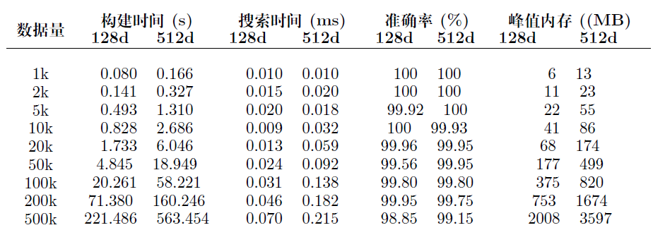

# Glasssix TrialFaceSDK
Document, binary module, example and billboard for face SDK of Trial version

## Glasssix TrialFaceSDK 

### Description

**Glasssix TrialFaceSDK** contains three key parts, i.e., **Longinus(Face Detect and Alignment)**, **Gaius(Feature Extractor)** and **Irisvian(Face Search)**. It can run in Android OS, Windows and Linux.

* Longinus(Face Detect and Alignment). See [Longinus](./doc/Longinus.md) for more details. 

* Gaius(Feature Extractor). See [Gaius](./doc/Gaius.md) for more details.

* Irisvian(Face Search). See [Irisvian](./doc/Irisvian.md) for more details. 

This trial face SDK is developed by GLASSSIX. The open source is now released under BSD-2 license (see [LICENSE](LICENSE) for details), which means the codes can be used freely for both acedemic purpose and industrial products.

### Test Report

根据实际使用场景，在x86平台选取1K,2K,5K,10K,20K,50K,100K,200K,500K的基础数据量(baseNum)分别进行测试（K表示1000条）。待查询数据量(queryNum)为基础数据量(baseNum)的十分之一,对每条待查询数据,返回10个相似度最高的结果。将返回的10个结果与通过高耗时暴力搜索方法找到的10个准确值进行对比，计算得到准确率。再用执行搜索任务的总时间除以查询数据量(queryNum)，得到每条数据的搜索时间。

测试平台基本信息:

测试结果：

### Contact Info

If you have any problem on Glasssix TrialFaceSDK, please contact us by sending email to inlmouse@glasssix.com.
If Glasssix TrialFaceSDK can not meet your business needs, please contact business@glasssix.com for business cooperation. For more AI services, please visit GLASSSIX official website: http://www.facebeacon.com.

### Other Documentation

* [SeetaFace2 Detection](./FaceDetection/README.md)
* [SeetaFace2 Alignment](./FaceAlignment/README.md)
* [SeetaFace2 Identification](./FaceIdentification/README.md)
* [SeetaFace2 Cropper](./FaceCropper/README.md)

### Download links

* [Attachment](./attachment/README.md)
