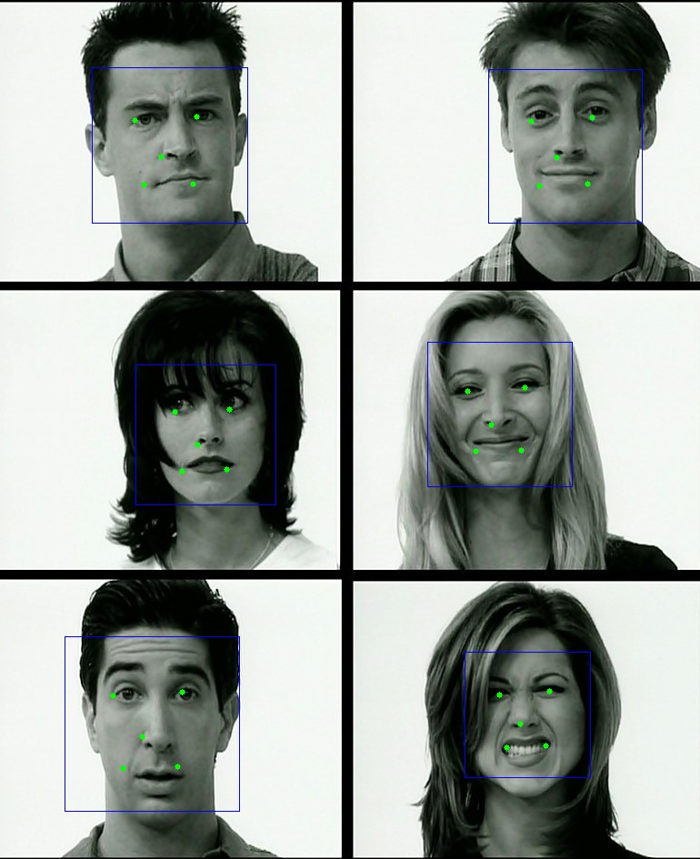

## 人脸检测V1.0(TrialFaceSDK)
### 接口功能
>人脸检测: 检测图片中人脸，并计算出人脸概率，绘制人脸矩形框，关键点（眼、鼻、嘴）位置等信息。
>#### 速览: LonginusDetector
| 核心函数 | 功能  |  返回值  |
|  :--------:   |  :--------:  | :--------:  |
| Longinucia_detect    | 在灰度图中检测并定位人脸区域，获取bboxs信息  |  int,检测出的人脸个数, >=0     |
| Longinucia_detectWithInfo        |   在灰度图中检测并定位人脸区域，获取bboxs和landmarks信息|   int,检测出的人脸个数, >=0  |
| Longinucia\_detectEx        |   在RGB图中检测并定位人脸区域 ,获取bboxs和landmarks信息 |  int,检测出的人脸个数, >=0 |
| Longinucia\_detectEx\_Mobile        |     在RGB图中检测并定位人脸区域 ,获取bboxs和landmarks信息     |  int,检测出的人脸个数, >=0 |

#### 示例代码
```c
#include <iostream>
#include "longinus_c.h"
#include <opencv2/opencv.hpp>

using namespace glasssix::longinus;

int main()
{
////此人脸识别开发包，不支持使用GPU
//设备号小于0，使用CPU；其他情形根据设备号使用该号GPU，默认值-1
int device = -1;
int type = 0;  //指明检测类型

//实例化一个LonginusDetector类的对象，并调用detector.set()函数.
LonginusDetector *detector = Longinus_NewInstance(device);
Longinus_set(detector, type, device);

//读取图片并转换为 灰度图
cv::Mat img = cv::imread("test.jpg");
cv::Mat gray;
cv::cvtColor(img, gray, CV_BGR2GRAY);

//检测人脸，并获取矩形框和关键点信息
FaceRectwithFaceInfo *rect;
float threshold[] = {0.6, 0.7, 0.7};
int num = Longinus_detectEx(detector, &rect, img.data, img.channels(), img.rows, img.cols, 24, threshold, 1.41f, 3, 1);


//输出检测到的人脸框位置信息
for(int i = 0; i < num; i++)
{
std::cout << i << ", x: " << rect[i].x << ", y: " << rect[i].y << ", width: " << rect[i].width << ", height: " << rect[i].height << std::endl;
}

//若检测到人脸，则将人脸信息（矩形框和关键点）依次存进bbox,landmarks指向的一维数组中
if(num)
{
int *bbox = new int[4 * num];
int *landmarks = new int[10 * num];
for(int i = 0; i < num; i++)
{
bbox[i * 4 + 0] = rect[i].x;
bbox[i * 4 + 1] = rect[i].y;
bbox[i * 4 + 2] = rect[i].width;
bbox[i * 4 + 3] = rect[i].height;
for(int j = 0; j < 5; j++)
{
landmarks[i * 10 + j * 2 + 0] = rect[i].pts[j].x;
landmarks[i * 10 + j * 2 + 1] = rect[i].pts[j].y;
}
}
//人脸对齐
unsigned char *result = Longinus_alignFace(detector, gray.data, num, gray.channels(), gray.rows, gray.cols, bbox, landmarks);

}
//释放一个LonginusDetector类的实例
Longinus_ReleaseInstance(detector);

//释放内存
delete[] result;
delete[] rect;

return 0;
}
```

#### 类名：LonginusDetector
##### 成员函数 ：LonginusDetector *Longinus_NewInstance(int device);
##### 功能：得到一个LonginusDetector类的实例
##### 返回值：LonginusDetector类实例的指针

##### 成员函数 ：void Longinus_ReleaseInstance(LonginusDetector *instance);
##### 功能：释放一个LonginusDetector类的实例

##### 成员函数 ：unsigned char *Longinus_getVersion();
##### 功能：获取Longinus版本
##### 返回值：返回版本字符串首地址

##### 成员函数 ：void Longinus_set(LonginusDetector *instance, int type, int device);
##### 功能：设置检测类型和使用设备号

|参数|参数类型|值|说明|备注|
|:--------:|:--------:|:--------:|:--------:|:--------:|
|instance|`LonginusDetector*`||指向LonginusDetector<br>实例的指针| |
|detection<br>Type| int|0=FRONTALVIEW <br> 1=FRONTALVIEW<br>_REINFORCE<br> 2=MULTIVIEW <br> 3= MULTIVIEW <br> _REINFORCE |正脸快速检测<br>正脸加强检测 <br>多角度检测<br> 多角度加强检测|检测效果依次变强<br>检测速度依次变慢|
|device|int|`<0`<br>`>=0`|使用cpu<br>使用设备号为<br>device的gpu

##### 成员函数 ：int Longinus_detect(LonginusDetector* instance, FaceRect** ptr, unsigned char gray, int width, int height, int step, int minSize, float scale,min_neighbors)
##### 功能：在灰度图中检测并定位人脸区域,同时获取bboxs信息
##### 返回值：int, 检测出的人脸个数, 大于等于0

##### 成员函数 ：int Longinus_detectWithInfo(LonginusDetector* instance, FaceRectWithFaceInfo** ptr, unsigned char gray, int width, int height, int step, int minSize, float scale,min_neighbors,int order)
##### 功能：在灰度图中检测并定位人脸区域,同时获取bboxs和landmarks信息
##### 返回值：int, 检测出的人脸个数, 大于等于0
<br>

|参数|参数类型|值|说明|备注|
|:--------:|:--------:|:--------:|:--------:|:--------:|
|instance|`LonginusDetector*`||指向LonginusDetector实例的指针| |
|ptr|`FaceRect**`<br>`FaceRectWithFaceInfo**`||FaceRect指针变量的地址<br>FaceRectwithFaceInfo指针变量的地址| |
|gray|`unsigned char *`|用户输入|灰度图数据地址| 需连续存储|
|width|int|用户输入|灰度图宽| |
|height|int|用户输入|灰度图高| |
|step|int|用户输入|灰度图每一行像素所占字节数| |
|minSize|int|有效值`>=24`|最小检测窗|检出的人脸区域`>=minSize`|
|scale|float|`>1`|图像检测缩放比例|一般设置大`>1.1`|
|min_neighbors|int|`>=0`|人脸区域附近候选框个数|一般设置3|
|order|int|order=0(NCHW),否则(NHWC)|人脸数据的排列方式:[NCHW/NHWC](https://www.cnblogs.com/sunny-li/p/9630305.html)||

###### FaceRect类描述：存放被检测人脸区域信息
|成员变量|类型|说明|备注|
|:--------:|:--------:|:--------:|:--------:|
|x|int|人脸区域左上角x坐标| |
|y|int|人脸区域左上角y坐标| |
|width|int|人脸区域宽度| |
|height|int|人脸区域高度| |
|neighbors|int|人脸区域候选框个数| 一般作为得分的判断|
|confidence|double|人脸区域置信度| 一般不作为得分的判断|
###### FaceRectwithFaceInfo类描述：(继承于 FaceRect)存放被检测人脸区域信息
|成员变量|类型|说明|备注|
|:--------:|:--------:|:--------:|:--------:|
|[yaw](https://en.wikipedia.org/wiki/Euler_angles)|float|头部基于z轴的旋转角度(范围 -180 and 180 度)| |
|[pitch](https://en.wikipedia.org/wiki/Euler_angles)|float|头部基于y轴的旋转角度(范围 -90 and 90 度)| |
|[roll](https://en.wikipedia.org/wiki/Euler_angles)|float|头部基于x轴的旋转角度(范围 -180 and 180 度)| |

##### 成员函数 ：int Longinus_detectEx(LonginusDetector* instance, FaceRectWithFaceInfo** ptr, unsigned char* image, int height, int width, int minSize,float* threshold, float factor, int stage,int order);
##### 功能：在RGB图中检测并定位人脸区域,获取bboxs和landmarks信息
##### 返回值：int, 检测出的人脸个数, 大于等于0

##### 成员函数 ：int Longinus_detectEx_Mobile(LonginusDetector* instance, FaceRectWithFaceInfo** ptr, unsigned char* image, int height, int width, int minSize,float* threshold, float factor, int stage,int order);
##### 功能：在RGB图中检测并定位人脸区域,获取bboxs和landmarks信息
##### 返回值：int, 检测出的人脸个数, 大于等于0

|参数|参数类型|值|说明|备注|
|:--------:|:--------:|:--------:|:--------:|:--------:|
|channel|int|用户输入|图像通道数| |
|image|`unsigned char *`|用户输入|RGB图数据地址| 需连续存储|
|width|int|用户输入|RGB图宽| |
|height|int|用户输入|RGB图高| |
|step|int|用户输入|RGB图每一行像素所占字节数| |
|minSize|int|有效值`>=24`|最小检测窗|检出的人脸区域`>=minSize`|
|scale|float|`>1`|图像检测缩放比例|一般设置大`>1.1`|
|min_neighbors|int|`>=0`|人脸区域附近候选框个数|一般设置3|
|threshold|float*|用户输入|表示置信度的阈值|一般赋值[0.6, 0.7, 0.7] (detect\_Ex)<br>一般赋值[0.5, 0.6, 0.8] (detectEx\_mobile)|
|factor|float|用户输入|缩放系数|大于1, 一般取1.41|
|stage|float|用户输入|需要执行的网络数|一般取3|
|order|int|order=0(NCHW),否则(NHWC)|人脸数据的排列方式:[NCHW/NHWC](https://www.cnblogs.com/sunny-li/p/9630305.html)||


## 人脸对齐
### 接口功能
>人脸对齐 :获取图片中每个对齐后的人脸框，并保存头部偏移欧拉角和关键点（眼睛、鼻子、嘴巴）信息}
> #### 速览: LonginusDetector

| 核心函数        | 功能   |  返回值  |
|  :--------:   |  :--------:  | :--------:  |
| Longinus_alignFace   | 对齐人脸|  返回n个对齐后的人脸数据首地址, 以NCHW排列|
| Longinus_alignFaceFromCropped        |  从已按1.4倍bbox宽高裁剪的图上对齐人脸|返回n个对齐后的人脸数据首地址, 以NCHW排列|

##### 成员函数 ：unsigned char* Longinus_alignFace( LonginusDetector* instance,unsigned char* ori_image, int n, int height,int width,int* bbox, int* landmarks);
##### 功能：对齐人脸
##### 返回值：返回n个对齐后的人脸数据首地址, 以NCHW排列。

##### 成员函数 ：unsigned char* Longinus_alignFaceFromCropped( LonginusDetector* instance,unsigned char* ori_image, int n, int height,int width,int* bbox, int* landmarks);
##### 功能：从已按1.4倍bbox宽高裁剪的图上对齐人脸
##### 返回值：返回n个对齐后的人脸数据首地址, 以NCHW排列。

|参数|参数类型|值|说明|备注|
|:--------:|:--------:|:--------:|:--------:|:--------:|
|ori_image|`unsigned char *`|用户输入|指向待检测的原始灰度图片数据地址| |
|n|int|用户输入|原始灰度图片张数,设为1| |
|width|int|用户输入|原始灰度图宽| |
|height|int|用户输入|原始灰度图高| |
|bboxes|int*|用户输入|一维int数组指针, 依次存放每个人脸bbox的x, y, w, h| |
|landmarks|int*|用户输入|一维int数组指针,依次存放每个人脸landmark的x1,y1,x2,y2,x3,y3,x4,y4,x5,y5| |


##### 成员函数 ： bool Longinus_blur_judge_vsl( LonginusDetector* instance,unsigned char* vsl_color_image, int height,int width,int n, int* bbox, int* landmarks,float* thresh, float** value, int order);
##### 功能：判断从可见光图像检测到的人脸是否模糊
##### 返回值：返回true时表示人脸图像清晰可用。

##### 成员函数 ： bool Longinus_black_white_judge_vsl( LonginusDetector* instance,unsigned char* vsl_color_image, int height,int width,int n, int* bbox, int* landmarks,float* thresh, float** value, int order);
##### 功能：判断采集的可见光图像内容是否为黑白照片
##### 返回值：返回true时表示图像可用，图像内容不是黑白照片。。

##### 成员函数 ：bool Longinus_face_nose_judge_vsl( LonginusDetector* instance,unsigned char* nir_color_image, int height,int width,int n, int* bbox, int* landmarks,float* thresh, float** value, int order);
##### 功能：判断从可见光图像检测到的人脸是否模糊
##### 返回值：返回true时，表示检测到真实人脸。
<br>

|参数|参数类型|值|说明|备注|
|:--------:|:--------:|:--------:|:--------:|:--------:|
|vsl_color_image|`unsigned char *`||检测使用的原始RGB图(可见光)的首地址| |
|nir_color_image|`unsigned char *`||检测使用的原始RGB图(近红外)的首地址| |
|n|int|用户输入|需进行模糊判断的人脸数(模糊判断)<br>需进行黑白判断的人脸数(黑白图片判断)<br>需进行认识人脸判断的人脸数(真实人脸判断)| |
|width|int|用户输入|原始灰度图宽| |
|height|int|用户输入|原始灰度图高| |
|bboxes|int*|用户输入|一维int数组指针, 依次存放每个人脸bbox的x, y, w, h| |
|landmarks|int*|用户输入|一维int数组指针,依次存放每个人脸landmark的<br>x1,y1,x2,y2,x3,y3,x4,y4,x5,y5| |
|thresh|float*|用户输入|评判阈值，包含2个元素的一维float数组首地址|默认取值[0.6,0] (模糊判断)<br>默认取值 [30,0] (黑白图片判断)<br>默认取值 [0.9,0.85] (真实人脸判断)|
|value|float**|用户输入|仅调试时需要，包含2个元素的一维float数组首地址,<br> 表示神经网络模型实际的计算结果，与thresh对比得到返回的bool值||
|order|int|order=0(NCHW)<br>否则(NHWC)|人脸数据的排列方式:[NCHW/NHWC](https://www.cnblogs.com/sunny-li/p/9630305.html)||

### 依赖项
>CPU: MSVCP140、VCRUNTIME140 

### 效果图



### 性能测试

##### 测试平台基本信息
|项目 | 描述|
|:-:|:-:|
|操作系统 | Windows 10 企业版 64位 |
|处理器 | Intel(R) Core(TM) i7-8700K CPU @ 3.70GHz |
|处理器核心数 | 6核12线程 |
|内存 | 32GB |
|编译器 | MSVC 19.5 |
|OpenMP | 开启 |
|SIMD指令集 | AVX2 |
##### Longinus性能
>用alfw数据库作为测试数据，测试不同检测接口性能，该数据库包含7148张正脸图片，8618条人脸矩形框标注和7496条关键点标注信息。

|接口名 | 检测时间指数 | 人脸检出率% | 矩形框准确率 %| 关键点误差|
|:-:|:-:|:-:|:-:|:-:|
|Longinucia_detectWithInfo | 1|97.37| 79.83 |0.2238  |
|Longinucia_detectEx |3 |97.86 | 75.22| 0.1987|
|Longinucia_detectEx_Mobile| 2 | 86.74 | 76.55| 0.1981|

