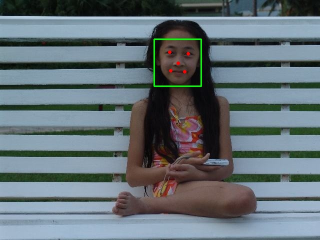
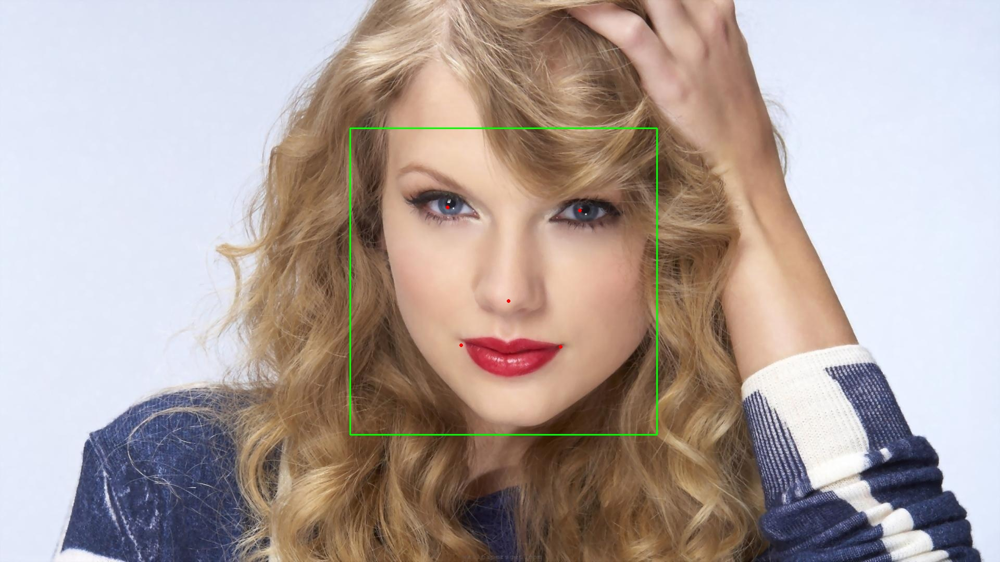

## 人脸识别 V1.0（TrialFaceSDK）
### 能力介绍
#### 接口能力
- **人脸识别**：检测图片中人脸，并计算出人脸概率、人脸角度、关键点（眼、鼻、嘴）位置等信息。
#### 依赖项
- **CPU**：
   - MSVCP141
   - VCRUNTIME141
   - .Net Framework 4.6.2
### 调用方式
#### 示例代码一
```C#
using System;
using System.Collections.Generic;
using System.Drawing;
using System.Drawing.Drawing2D;
using System.Linq;
using System.Text;
using System.Threading.Tasks;
using glasssix.longinus;

namespace CSharpExample
{
    class Program
    {
        static void Main(string[] args)
        {
            int device = -1;
            Bitmap bmp = new Bitmap(@"D:\720.jpg");
            Longinucia longinucia = new Longinucia();
            longinucia.set(DetectorType.MULTIVIEW_REINFORCE, device);
            var res = longinucia.Face_Detect(bmp, 24, 1.1f, 3, false, false, true);

            var aligned_faces = longinucia.AlignFace(bmp, res);
            for (int i = 0; i < aligned_faces.Length; i++)
            {
                aligned_faces[i].Save(@"D:\720_align" + i + ".jpg");
            }

            for (int i = 0; i < res.Count; i++)
            {
                DrawRectangleInPicture(bmp,
                    new Rectangle(res[i].rect.X, res[i].rect.Y, res[i].rect.Width, res[i].rect.Height), Color.Azure, 2,
                    DashStyle.Dash);
            }
            bmp.Save(@"D:\720_res.jpg");

            return;
        }

        public static Bitmap DrawRectangleInPicture(Bitmap bmp, Rectangle rect, Color RectColor, int LineWidth, DashStyle ds)
        {
            if (bmp == null) return null;
            Graphics g = Graphics.FromImage(bmp);
            Brush brush = new SolidBrush(RectColor);
            Pen pen = new Pen(brush, LineWidth);
            pen.DashStyle = ds;
            g.DrawRectangle(pen, rect);
            g.Dispose();
            return bmp;
        }
    }
}
```

#### ```Longinucia``` 类
##### 构造函数 ```public Longinucia()```
功能：创建一个 Longinucia 类的实例。

##### 构造函数 ```public Longinucia(int width, int height)```
功能：创建一个 Longinucia 类的实例，并指定图片尺寸。

|参数|参数类型|值|说明|备注|
|:---:|:---:|:---:|:---:|:---:|
|width|```int```|用户输入|图片的像素宽度||
|height|```int```|用户输入|图片的像素高度||

##### 方法 ```public void set(DetectorType type, int device)```
功能：设置检测方式。

|参数|参数类型|值|说明|备注|
|:---:|:---:|:---:|:---:|:---:|
|type|```DetectorType```|FRONTALVIEW<br>FRONTALVIEW_REINFORCE<br>MULTIVIEW<br> MULTIVIEW_REINFORCE|正脸快速检测<br>正脸加强检测<br>多角度检测<br>多角度加强检测|检测效果依次变强<br>检测速度依次变慢||
|device|int|```<0```<br>```>=0```|使用 CPU 作为物理设备<br>使用设备号为 device 的 GPU 作为物理设备| |

##### 方法 ```public List<FaceInfo> Face_Detect(Bitmap bmp, int min_size, float scale, int minNeighbors, bool useMultiThreads, bool doEarlyReject, bool doLandmark)```
功能：对输入灰度图做人脸检测并标定人脸位置。

|参数|参数类型|值|说明|备注|
|:---:|:---:|:---:|:---:|:---:|
|bmp|```Bitmap```|用户输入|灰度图||
|minSize|```int```|有效值```>=24```|最小检测窗|检出的人脸区域 ```>= minSize```|
|scale|```float```|```> 1```|图像检测缩放比例|一般设置 ```> 1.1```|
|minNeighbors|```int```|```>=0```|人脸区域附近候选框个数|一般设置 3|
|useMultiThreads|```bool```|```true```<br>```false```|使用多线程<br>使用单线程|仅对使用 CPU 工作时有效。默认值 ```false``` 。|
|doEarlyReject|```bool```|```true```<br>```false```|采取早期拒绝<br>不采取早期拒绝|设置为 ```true``` 时可提高检测速度，但检测效果下降；设置 ```false``` 则相反。默认值 ```false```。|

- 返回：```List<FaceInfo>``` 类型，包含了每一个检测到的人脸区域、关键点和人脸概率信息。

##### 方法 ```public Bitmap[] AlignFace(Bitmap bmp, List<FaceInfo> infos)```
功能：对输入灰度图做人脸检测并标定人脸位置。

|参数|参数类型|值|说明|备注|
|:---:|:---:|:---:|:---:|:---:|
|bmp|```Bitmap```|用户输入|灰度图, 与Face_Detect函数输入相同||
|infos|```List<FaceInfo>```| |检测到的人脸信息|Face_Detect函数的返回结果|

- 返回：```Bitmap[]``` 类型，包含了对齐后的人脸，图片为128*128的3通道图像。

#### Longinus 性能表现
在 i7-8700K 平台使用 640 \* 480、1280 \* 720 和 1920 \* 1080三张人脸图片分别进行测试，每张图片循环 1000 次计算得到平均检测时间。

##### 测试平台基本信息
项目 | 描述
:-:|:-:
操作系统 | Windows 10 企业版 64位 |
处理器 | Intel(R) Core(TM) i7-8700K CPU @ 3.70GHz |
处理器核心数 | 6核12线程 |
内存 | 32GB |
编译器 | MSVC 19.5 |
OpenMP | 开启 |
SIMD 指令集 | AVX2 |


##### 测试结果

Parameter: minSize=48, scale=1.2, minNeighbors=3, useMultiThreads=false, doEarlyReject=false

Detection Time (ms)：

Size | FRONTALVIEW | FRONTALVIEW_REINFORCE | MULTIVIEW | MULTIVIEW_REINFORCE
:-:|:-:|:-:|:-:|:-:
640 * 480 | 11.72 | 25.72 | 34.06 | 41.42 |
1280 * 720 | 26.14 | 45.44 | 69.09 | 85.07 |
1920 * 1080 | 76.59 | 122.38 | 155.89 | 186.86 |





声明：测试图片来源于网络，版权归原作者所有。如有侵权，请联系本人删除，谢谢。