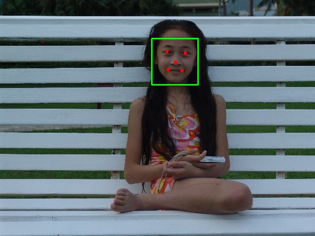
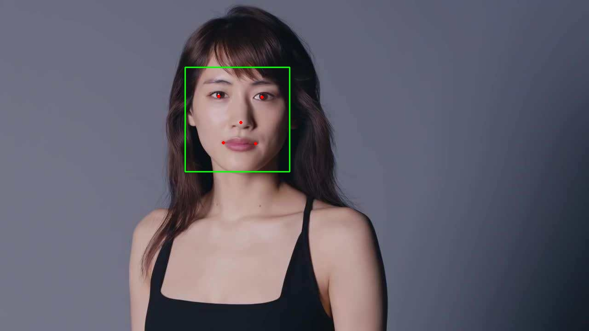
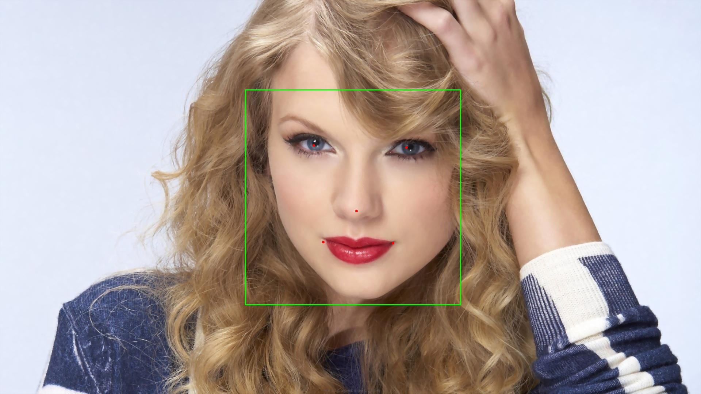

## 人脸检测V1.0(TrialFaceSDK)
### 能力介绍
#### 接口能力
- **人脸检测**: 检测图片中人脸，并计算出人脸概率、人脸角度、关键点（眼、鼻、嘴）位置等信息
#### 依赖项
- **CPU**: MSVCP140、VCRUNTIME140
### 调用方式
#### 示例代码一
```c++
#include <opencv2/opencv.hpp>
#include "Longinus/LonginusDetector.hpp"

using namespace glasssix;
using namespace glasssix::longinus;

int main()
{
    //do not support GPU in TrialFaceSDK
	int device = -1;//using CPU when device is less than zero, otherwise use the GPU numbered by 'device', device is set to -1 by default.
	LonginusDetector detector;
	detector.set(FRONTALVIEW, device);
	
	cv::Mat img = cv::imread("../TestImage/2.png");
	cv::Mat gray;
	cv::cvtColor(img, gray, CV_BGR2GRAY);
	std::vector<FaceRect> rects = detector.detect(gray.data, gray.cols, gray.rows, gray.step[0], 24, 1.1f, 3, false, false);
	for (int i = 0; i < rects.size(); i++)
		cv::rectangle(img, cv::Rect(rects[i].x, rects[i].y, rects[i].width, rects[i].height), cv::Scalar(0, 255, 0));

	cv::imshow("hehe", img);
	cv::waitKey(0);
	return 0;
}
```
#### RomanciaDetector类说明
##### 成员函数`void set(DetectionType detectionType, int device);`
功能: 设置检测方式

|参数|参数类型|值|说明|备注|
|:--------:|:--------:|:--------:|:--------:|:--------:|
|detectionType|enum DetectionType|FRONTALVIEW<br>FRONTALVIEW_REINFORCE<br>MULTIVIEW<br> MULTIVIEW_REINFORCE|正脸快速检测<br>正脸加强检测<br>多角度检测<br>多角度加强检测|检测效果依次变强<br>检测速度依次变慢|
|device|int|`<0`<br>`>=0`|使用cpu<br>使用设备号为device的gpu| |

##### 成员函数`void load(std::vector<std::string> cascades, int device = -1);`
功能: 加载分类器模型

|参数|参数类型|值|说明|备注|
|:--------:|:--------:|:--------:|:--------:|:--------:|
|cascades|`std::vector<std::string>`|用户输入|vector中每个元素对应一个模型文件路径|xml形式模型文件|
|device|int|`<0`<br>`>=0`|使用cpu<br>使用设备号为device的gpu| |

##### 成员函数`std::vector<FaceRect> detect(unsigned char *gray, int width, int height, int step, int minSize, float scale, int min_neighbors, bool useMultiThreads = false, bool doEarlyReject = false);`
功能: 对输入灰度图做人脸检测并标定人脸位置

|参数|参数类型|值|说明|备注|
|:--------:|:--------:|:--------:|:--------:|:--------:|
|gray|`unsigned char *`|用户输入|灰度图数据地址| 需连续存储|
|width|int|用户输入|灰度图宽| |
|height|int|用户输入|灰度图高| |
|step|int|用户输入|灰度图每一行像素所占字节数| |
|minSize|int|有效值`>=24`|最小检测窗|检出的人脸区域`>=minSize`|
|scale|float|`>1`|图像检测缩放比例|一般设置大`>1.1`|
|min_neighbors|int|`>=0`|人脸区域附近候选框个数|一般设置3|
|useMultiThreads|bool|true<br>false|使用多线程<br>使用单线程|仅对使用cpu工作时有效, 默认值false|
|doEarlyReject|bool|true<br>false|采取早期拒绝<br>不采取早期拒绝|设置true时可提高检测速度，但检测效果下降，设置false则相反, 默认值false|

- 返回值
`std::vector<FaceRect>`类型, vector中包含了每一个检测到的人脸区域信息

###### FaceRect类型说明

|成员变量|类型|说明|备注|
|:--------:|:--------:|:--------:|:--------:|
|x|int|人脸区域左上角x坐标| |
|y|int|人脸区域左上角y坐标| |
|width|int|人脸区域宽度| |
|height|int|人脸区域高度| |
|neighbors|int|人脸区域候选框个数| 一般作为得分的判断|
|confidence|double|人脸区域置信度| 一般不作为得分的判断|


#### 示例代码二
```c++
#include <opencv2/opencv.hpp>
#include <iostream>
#include "Longinus/LonginusDetector.hpp"

using namespace cv;
using namespace glasssix::longinus;
using namespace std;

int main()
{
	//transform color image to gray image
	Mat src_image, gray_image;
	src_image = imread("D:/xiaoyuankeji.jpg");
	cvtColor(src_image, gray_image, CV_BGR2GRAY);

	//detect face rect
	LonginusDetector detector;
	//do not support GPU in TrialFaceSDK
	int device = -1;//using CPU when device is less than zero, otherwise use the GPU numbered by 'device', device is set to -1 by default.
	int order = 0;//order==0(NCHW),others(NHWC), order is set to zero by default.
	detector.set(MULTIVIEW_REINFORCE, -1);	
	std::vector<FaceRectwithFaceInfo> faceBox;
	
    //detect from gray image, recommended!
	faceBox = detector.detect(gray_image.data, gray_image.cols, gray_image.rows, gray_image.step[0], 80, 1.1f, 3, order, false, false);

	//store bboxes with face rects , store landmarks with key points(eye,nose,mouth)
	std::vector<std::vector<int>> bboxes;
	std::vector<std::vector<int>> landmarks;
	extract_faceinfo(faceBox, bboxes, landmarks);
	
	std::vector<std::vector<float>> angles;
	angles.resize(faceBox.size());
	//draw face rects and key points on src_image
	for (size_t i = 0; i < faceBox.size(); i++)
	{
		//head pose
		angles[i].push_back(faceBox[i].yaw);
		angles[i].push_back(faceBox[i].pitch);
		angles[i].push_back(faceBox[i].roll);

		//draw face rects
		cv::rectangle(src_image, cv::Rect(bboxes[i][0], bboxes[i][1], bboxes[i][2], bboxes[i][3]), cv::Scalar(255, 0, 0), 1);
		
		//draw key points
		cv::circle(src_image, cv::Point(landmarks[i][0], landmarks[i][1]), 3, Scalar(0, 255, 0), -1);//left eye
		cv::circle(src_image, cv::Point(landmarks[i][2], landmarks[i][3]), 3, Scalar(0, 255, 0), -1);//right eye
		cv::circle(src_image, cv::Point(landmarks[i][4], landmarks[i][5]), 3, Scalar(0, 255, 0), -1);//nose
		cv::circle(src_image, cv::Point(landmarks[i][6], landmarks[i][7]), 3, Scalar(0, 255, 0), -1);//left mouse
		cv::circle(src_image, cv::Point(landmarks[i][8], landmarks[i][9]), 3, Scalar(0, 255, 0), -1);//right mouse
	}

	//show image labeled with face rects and key points
	imshow("src", src_image);
	waitKey(0);
	
	//face alignment
	std::vector<unsigned char> alignedImages = detector.alignFace(gray_image.data, 1, gray_image.channels(), gray_image.rows, gray_image.cols, bboxes, landmarks);
	unsigned char* temp = (unsigned char*)malloc(3 * 128 * 128);
	for (size_t i = 0; i < faceBox.size(); i++)
	{
		memcpy(temp, alignedImages.data() + i * 3 * 128 * 128, 3 * 128 * 128 * sizeof(unsigned char));
		cv::Mat alignedFace(128,128,CV_8UC3,temp);
		cv::imshow("alignedFace", alignedFace);
		cv::waitKey(0);
	}
	delete temp;
	
	destroyAllWindows();
	return 0;
}
```

##### 成员函数`std::vector<FaceRectwithFaceInfo> detect(unsigned char *gray, int width, int height, int step, int minSize, float scale, int min_neighbors, int order = 0, bool useMultiThreads = false, bool doEarlyReject = false);`
功能: 对输入灰度图做人脸检测并标定人脸位置

|参数|参数类型|值|说明|备注|
|:--------:|:--------:|:--------:|:--------:|:--------:|
|gray|`unsigned char *`|用户输入|灰度图数据地址| 需连续存储|
|width|int|用户输入|灰度图宽| |
|height|int|用户输入|灰度图高| |
|step|int|用户输入|灰度图每一行像素所占字节数| |
|minSize|int|有效值`>=24`|最小检测窗|检出的人脸区域`>=minSize`|
|scale|float|`>1`|图像检测缩放比例|一般设置大`>1.1`|
|min_neighbors|int|`>=0`|人脸区域附近候选框个数|一般设置3|
|order|int||人脸数据的排列方式:NCHW/NHWC|order=0(NCHW),否则(NHWC)|
|useMultiThreads|bool|true<br>false|使用多线程<br>使用单线程|仅对使用cpu工作时有效, 默认值false|
|doErlyReject|bool|true<br>false|采取早期拒绝<br>不采取早期拒绝|设置true时可提高检测速度，但检测效果下降，设置false则相反, 默认值false|

- 返回值
`std::vector<FaceRectwithFaceInfo>`类型, vector中包含了每一个检测到的人脸区域、关键点、人脸概率信息

##### 成员函数`void extract_faceinfo(std::vector<FaceRectwithFaceInfo> face_info, std::vector<std::vector<int>>& bboxes, std::vector<std::vector<int>>& landmarks);`
功能: 提取出矩形人脸框和人脸关键点，存放至bboxes和landmarks

|参数|参数类型|值|说明|备注|
|:--------:|:--------:|:--------:|:--------:|:--------:|
|face_info|`std::vector<FaceRectwithFaceInfo>`| |检测到的人脸信息| |
|bboxes|`std::vector<std::vector<int>>`| |bboxes.size():检测到的人脸个数，bboxes[i][0]:x，bboxes[i][1]:y，bboxes[i][2]:width，bboxes[i][3]:height| |
|landmarks|`std::vector<std::vector<int>>`| |landmarks.size():检测到的人脸个数，landmarks[i][0]:x_lefteye，landmarks[i][1]:y_lefteye，landmarks[i][2]:x_righteye，landmarks[i][3]:y_righteye，landmarks[i][4]:x_nose，landmarks[i][5]:y_nose，landmarks[i][6]:x_leftmouse，landmarks[i][7]:y_leftnouse，landmarks[i][8]:x_rightmouth，landmarks[i][9]:y_rightmouth| |

##### 成员函数`void extract_biggest_faceinfo(std::vector<FaceRectwithFaceInfo> face_info, std::vector<std::vector<int>>& bboxes, std::vector<std::vector<int>>& landmarks);`
功能: 提取出面积最大人脸的矩形人脸框和人脸关键点，存放至bboxes和landmarks

|参数|参数类型|值|说明|备注|
|:--------:|:--------:|:--------:|:--------:|:--------:|
|face_info|`std::vector<FaceRectwithFaceInfo>`| |检测到的人脸信息| |
|bboxes|std::vector<std::vector<int>>| |同extract_faceinfo| |
|landmarks|std::vector<std::vector<int>>| |同extract_faceinfo| |

##### 成员函数`std::vector<unsigned char> alignFace(const unsigned char* ori_image, int n, int channels, int height, int width, std::vector<std::vector<int>> bbox, std::vector<std::vector<int> >landmarks);`
功能: 对齐人脸

|参数|参数类型|值|说明|备注|
|:--------:|:--------:|:--------:|:--------:|:--------:|
|ori_image|`const unsigned char*`| |用于检测人脸的原始灰度图片| |
|n|`int`| |原始灰度图片张数，设为1| |
|channels|`int`| |原始灰度图片通道数| |
|height|`int`| |原始灰度图片高度| |
|width|`int`| |原始灰度图片宽度| |
|bbox|`std::vector<std::vector<int>>`| |同extract_faceinfo| |
|landmarks|`std::vector<std::vector<int>>`| |同extract_faceinfo| |

- 返回值
`std::vector<unsigned char>`, vector中包含了每一个对齐后的人脸灰度图像数据，通过OpenCV可显示


## 人脸匹配
### 能力介绍
#### 接口能力
- **人脸匹配**: 输入连续视频序列检测结果，匹配前后帧人脸是否属于同一个人。仅在摄像机机位不变的连续视频中有意义。
### 调用方式
#### 示例代码三
```c++
#include <iostream>
#include <opencv2/opencv.hpp>
#include "Longinus/LonginusDetector.hpp"
#include <map>

using namespace glasssix;
using namespace glasssix::longinus;

int main(int argc, char** argv)
{
	cv::Mat frame;
	cv::Mat gray;
	int frame_extract_frequency = 5; // frequency of extracting one frame
	cv::VideoCapture capture("..\\data\\group.mp4");

	if (!capture.isOpened())
	{
		std::cout << "Reading Video Failed !" << std::endl;
		getchar();
		return 0;
	}

	int frame_num = capture.get(cv::CAP_PROP_FRAME_COUNT);
	int device = -1;
	LonginusDetector detector;
	detector.set(MULTIVIEW_REINFORCE, device);

	// loop through every frame in the video
	for (int i = 0; i < frame_num - 1; i++)
	{
		capture >> frame;
		cv::cvtColor(frame, gray, cv::COLOR_RGB2GRAY);

		if (i % frame_extract_frequency == 0)
		{
			// retrieve a number of rects, it calls detector.detect(), which returns frontal face detections.
	        std::vector<FaceRect> rects = detector.detect(gray.data, gray.cols, gray.rows, gray.step[0], 24, 1.1f, 3, false, false);
			auto results = detector.match(rects, frame_extract_frequency);// you can also use std::vector<FaceRectwithFaceInfo>, modify detector.detect()

			// show the face rects and string id on every frame
			for (size_t j = 0; j < results.size(); j++) {
				cv::Rect temp_(results[j].rect.x, results[j].rect.y, results[j].rect.width, results[j].rect.height);
				cv::rectangle(frame, temp_, cv::Scalar(0, 0, 255));
				cv::putText(frame, results[j].id, temp_.tl(), cv::FONT_HERSHEY_SIMPLEX, 0.5, cv::Scalar(255, 255, 255), 1, CV_AA);
			} // end-for-j
			
			//matcher_.print_map();
		} // end-if-mod-frequency
		
		// display 1 frame every num frames
		if (i % frame_extract_frequency == 0) {
			cv::imshow("test", frame);
			cv::waitKey(5);
		}
	} // end-for-i

	return 0;
}
```
#### Matcher类说明
##### 成员函数`std::vector<Match_Retval> match(std::vector<FaceRect> &faceRect, const int frame_extract_frequency);`
功能: 为每个输入的检测到的人脸框赋uuid，判定其是否是第一次出现在视频中

|参数|参数类型|值|说明|备注|
|:--------:|:--------:|:--------:|:--------:|:--------:|
|faceRect|`std::vector<FaceRect>`|--|通常由LonginusDetector中的detect函数得到|
|frame_extract_frequency|int|大于等于1的正整数|支持对视频的抽帧，该值为外部处理时的抽帧间隔| |

- 返回值
`std::vector<Match_Retval>`类型, vector中包含了每一个检测到的人脸区域信息以及uuid

##### 成员函数`std::vector<Match_Retval> match(std::vector<FaceRectwithFaceInfo> &faceRect, const int frame_extract_frequency);`
功能: 为每个输入的检测到的人脸框赋uuid，判定其是否是第一次出现在视频中

|参数|参数类型|值|说明|备注|
|:--------:|:--------:|:--------:|:--------:|:--------:|
|faceRect|`std::vector<FaceRectwithFaceInfo>`|--|通常由LonginusDetector中的detect函数得到|
|frame_extract_frequency|int|大于等于1的正整数|支持对视频的抽帧，该值为外部处理时的抽帧间隔| |

- 返回值
`std::vector<Match_Retval>`类型, vector中包含了每一个检测到的人脸区域信息以及uuid

###### Match_Retval类型说明

|成员变量|类型|说明|备注|
|:--------:|:--------:|:--------:|:--------:|
|rect|FaceRect|人脸区域| |
|id|std::string|对该人脸框赋值的uuid，通常为32位| |
|is_new|bool|对该人脸区域的判定是否为一个新的人脸序列| |


#### Longinus性能表现
在i7-8700K平台使用640 \* 480,1280 \* 720,1920 \* 1080三张人脸图片分别进行测试，每张图片循环1000次计算得到平均检测时间。

##### 测试平台基本信息
项目 | 描述
:-:|:-:
操作系统 | Windows 10 企业版 64位 |
处理器 | Intel(R) Core(TM) i7-8700K CPU @ 3.70GHz |
处理器核心数 | 6核12线程 |
内存 | 32GB |
编译器 | MSVC 19.5 |
OpenMP | 开启 |
SIMD指令集 | AVX2 |


##### 测试结果

Parameter: minSize=48, scale=1.2, minNeighbors=3, useMultiThreads=false, doEarlyReject=false

Detect Time(ms)：

Image_Size | FRONTALVIEW | FRONTALVIEW_REINFORCE | MULTIVIEW | MULTIVIEW_REINFORCE
:-:|:-:|:-:|:-:|:-:
640 * 480 | 11.72 | 25.72 | 34.06 | 41.42 |
1280 * 720 | 26.14 | 45.44 | 69.09 | 85.07 |
1920 * 1080 | 76.59 | 122.38 | 155.89 | 186.86 |





声明：测试图片来源于网络，版权归原作者所有，如有侵权，请联系删除，谢谢。